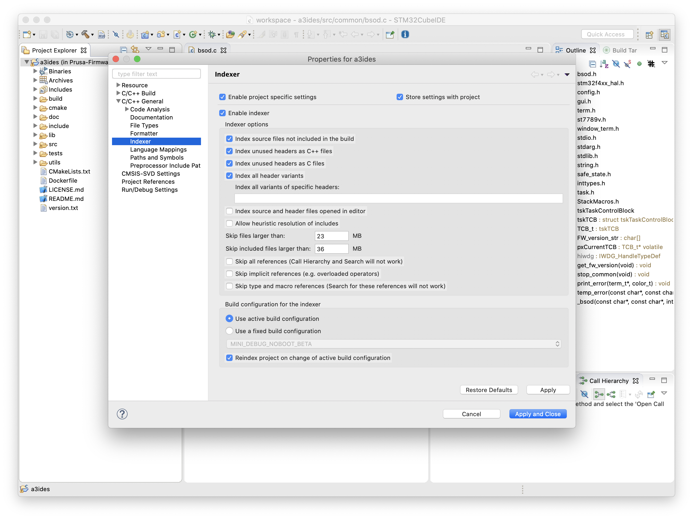
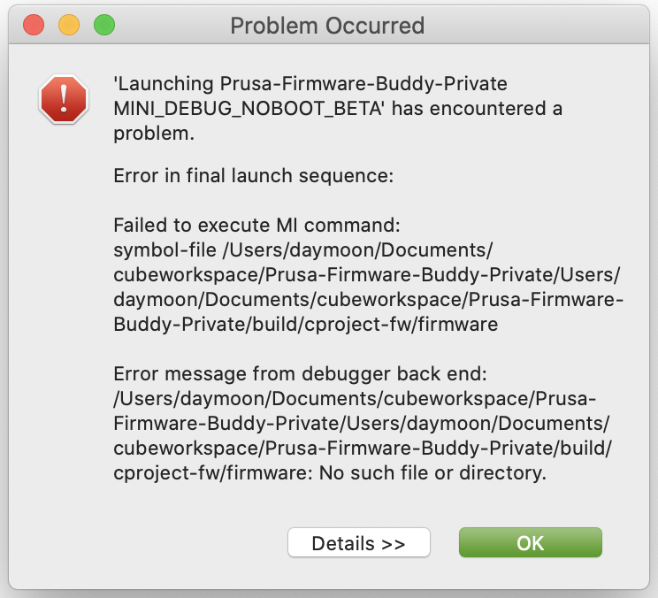

### Development using STM32CubeIDE (all platforms)

Installation:

1. Install latest STM32CubeIDE ([link](https://www.st.com/en/development-tools/stm32cubeide.html))
2. Install `cmake4eclipse 2.1.4` extension (`Help` > `Install new software...`> Work with: https://raw.githubusercontent.com/15knots/cmake4eclipse/master/releng/comp-update/ select `cmake4eclipse` version 2.1.4 and install it) (Later version is not supported by project generator)
3. For FreeRTOS-aware debugging, install the `FreeRTOS` plugin [from here](https://mcuoneclipse.com/2016/07/06/freertos-kernel-awareness-for-eclipse-from-nxp/).
4. Install some spell checker (e.g. [Eclipse CDT](https://www.eclipse.org/cdt/) includes one).

Generate and open the project:

1. Generate a project file by running: `python utils/build.py --generate-dfu --generate-cproject`
2. Open the project in the IDE (`File` > `Import Projects from File System...` > Select the root directory of this repository > `Finish`)
3. Right click on the project and select `Properties`. Make sure the settings for `Indexer` is the same as on the screenshot below (sometimes, it does not get loaded).
    

> 💡Changes to the generated project are not tracked by git.
> The build is still driven by CMake; therefore, if you want to add a file or change some compiler settings, change it in CMakeLists.txt directly.

### FAQ

#### Error in final launch sequence: Failed to execute MI command ... and a looong file path

This happens when a debug configuration contains an _absolute_ path to the firmware. Just change it to a relative one (beginning with `build/`, or `build\` on windows).

#### Stepping by instruction before the RTOS starts

Checkout the [README.md](https://github.com/Marus/cortex-debug) of the Cortex-Debug extension:
> As a general rule do not try to use stepping instructions before the scheduler of your RTOS has started - in many cases this tends to crash the GDB servers or leave it in an inconsistent state.

You can always disable FreeRTOS debugging by removing the line `"rtos": "FreeRTOS"` from `.vscode/launch.json`.
