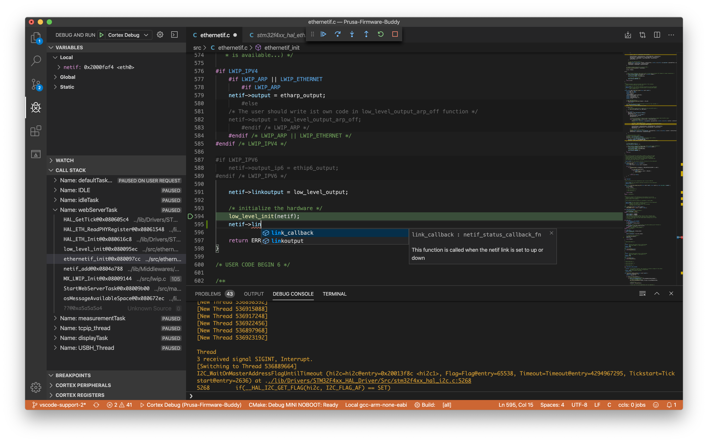

### Development using Visual Studio Code



1. In Visual Studio Code, install the following extensions:
    - `CMake Tools` (handles configuring and building the project, requires CMake to be installed),
    - `Cortex-Debug` and `Cortex-Debug: Device Support Pack - STM32F4` (support for debugging of the firmware),
        - The most recent and working `Cortex-Debug` for `ST-LINK` is `1.1.0`
    - `clangd` extension, which provides autocompletion and code navigation, download language server via this extension.
    - `Code Spell Checker` (streetsidesoftware.code-spell-checker) extension, which provides spell checking and correction suggestions.

3. Install OpenOCD
    - Linux: `sudo apt install openocd`
    - Mac: `brew install openocd --HEAD`
    - <details>
        <summary>Windows</summary>
        1. Download the latest version from [here](https://gnutoolchains.com/arm-eabi/openocd).
        2. Extract the content to some permanent location.
        3. In vscode, Ctrl+Shift+P and `Preferences: Open Settings (JSON)`
        4. Add the following line with appropriate path the openocd executable.

            ```json
            "cortex-debug.openocdPath": "c:\\Path\\To\\openocd.exe"
            ```
        </details>

3. In Visual Studio Code, open the directory with this repository.

### FAQ

#### Bad CMake Executable "", VSCODE cannot configure project

This is a well known issue. See [https://github.com/microsoft/vscode-cmake-tools/issues/685](https://github.com/microsoft/vscode-cmake-tools/issues/685) for more details.
Workaround is to reinstall CMake, close vscode and with another start the project should configure itself with no problem.

#### OpenOCD: Error: Can't find interface/stlink.cfg

Most likely, your OpenOCD is too old (or let's rephrase it - not new enough). The general solution is to uninstall it and build it from source yourself! Yay! 💪

1. `git clone https://github.com/ntfreak/openocd.git`
2. And follow the instructions in the readme (your are mostly interested in `OpenOCD Dependencies` and `Compiling OpenOCD`). These tips would be handy during the process:
    1. use `--enable-stlink` parameter in `./configure`
    1. run `sudo apt install libusb-1.0-0-dev` (installs USB dependency)
    1. use `-j` parameter in `make`

#### Linux/Ubuntu: libusb_open() failed with LIBUSB_ERROR_ACCESS
If you get an error like this, you are missing permissions to access the USB interface:
On Ubuntu this may be solved:

```bash
echo 'SUBSYSTEM=="usb",GROUP="users",MODE="0666"' > /etc/udev/rules.d/90-usbpermission.rules
udevadm control --reload-rules
```
If you face permission issues run this:
```bash
sudo touch /etc/udev/rules.d/90-usbpermission.rules
sudo vim /etc/udev/rules.d/90-usbpermission.rules
sudo udevadm control --reload-rules
```
You can pick your favorite editor instead in `vim`. In the editor place this line, save and quit:
`SUBSYSTEM=="usb",GROUP="users",MODE="0666"`

Unplug and plug the STlink back and it should work.

#### Linux/Ubuntu: Error: couldn't bind tcl to socket on port 6666: Address already in use

The openocd process is already running - kill it ;) .
This also can keep doing an Issue below with `libncurses`.

#### Linux/Ubuntu: arm-none-eabi-gdb not working

If you get an error like `error while loading shared libraries: libncurses.so.5: cannot open shared object file: No such file or directory`
on a newer incarnation of Linux/Ubuntu, it means your libraries (libncurses and probably also libtinfo) are newer than the arm-gdb was compiled for.
The output from `ldd` shows, that the arm-gdb didn't get all its libraries:

```bash
$ ldd PrusaFirmwareBuddy/.dependencies/gcc-arm-none-eabi-13.2.1/bin/arm-none-eabi-gdb
        linux-vdso.so.1 (0x00007fff072a8000)
        libdl.so.2 => /lib/x86_64-linux-gnu/libdl.so.2 (0x00007f900b711000)
        libncurses.so.5 => not found
        libtinfo.so.5 => not found
        libm.so.6 => /lib/x86_64-linux-gnu/libm.so.6 (0x00007f900b5c2000)
        libc.so.6 => /lib/x86_64-linux-gnu/libc.so.6 (0x00007f900b3d1000)
        /lib64/ld-linux-x86-64.so.2 (0x00007f900b751000)
```

On Ubuntu 19.10 or Arch Linux this is exacty the case, the system contains `libncurses.so.6` and not `libncurses.so.5`.
This may be _hacked_ similarly like this:

```bash
ln -s /usr/lib/x86_64-linux-gnu/libncurses.so.6 /usr/lib/x86_64-linux-gnu/libncurses.so.5
ln -s /usr/lib/x86_64-linux-gnu/libtinfo.so.6 /usr/lib/x86_64-linux-gnu/libtinfo.so.5
```
Surprisingly, the arm-gdb is fine and works well then.
