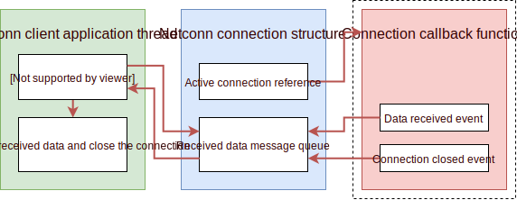
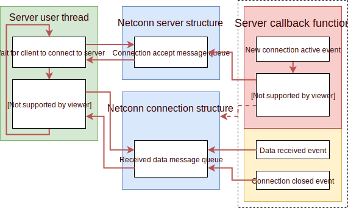

.. _api_app_netconn:

Netconn API
===========

*Netconn API* is addon on top of existing connection module and allows sending and receiving data with sequential API calls, similar to *POSIX socket* API.

It can operate in client or server mode and uses operating system features, such as message queues and semaphore to link non-blocking callback API for connections with sequential API for application thread.

.. note::
    Connection API does not directly allow receiving data with sequential and linear code execution.
    All is based on connection event system.
    Netconn adds this functionality as it is implemented on top of regular connection API.

.. warning::
    Netconn API are designed to be called from application threads ONLY.
    It is not allowed to call any of *netconn API* functions from within interrupt or callback event functions.

Netconn client
^^^^^^^^^^^^^^

    Netconn API client block diagram

Above block diagram shows basic architecture of netconn client application.
There is always one application thread (in green) which calls *netconn API* functions to interact with connection API in synchronous mode.

Every netconn connection uses dedicated structure to handle message queue for data received packet buffers.
Each time new packet is received (red block, *data received event*), reference to it is written to message queue of netconn structure, while application thread reads new entries from the same queue to get packets.

.. literalinclude:: ../../../snippets/netconn_client.c
    :language: c
    :linenos:
    :caption: Netconn client example

Netconn server
^^^^^^^^^^^^^^

    Netconn API server block diagram

When netconn is configured in server mode, it is possible to accept new clients from remote side.
Application creates *netconn server connection*, which can only accept *clients* and cannot send/receive any data.
It configures server on dedicated port (selected by application) and listens on it.

When new client connects, *server callback function* is called with *new active connection event*.
Newly accepted connection is then written to server structure netconn which is later read by application thread.
At the same time, *netconn connection* structure (blue) is created to allow standard send/receive operation on active connection.

.. note::
    Each connected client has its own *netconn connection* structure.
    When multiple clients connect to server at the same time, multiple entries are written to *connection accept* message queue and are ready to be processed by application thread.

From this point, program flow is the same as in case of *netconn client*.

This is basic example for netconn thread.
It waits for client and processes it in blocking mode.

.. warning::
    When multiple clients connect at the same time to netconn server,
    they are processed one-by-one, sequentially. This may introduce delay in response for other clients.
    Check netconn concurrency option to process multiple clients at the same time

.. literalinclude:: ../../../snippets/netconn_server_1thread.c
    :language: c
    :linenos:
    :caption: Netconn server with single processing thread

Netconn server concurrency
^^^^^^^^^^^^^^^^^^^^^^^^^^

.. figure:: ../../static/images/netconn_server_concurrency.svg
	:align: center
	:alt: Netconn API server concurrency block diagram

	Netconn API server concurrency block diagram

When compared to classic netconn server, concurrent netconn server mode allows multiple clients to be processed at the same time.
This can drastically improve performance and response time on clients side, especially when many clients are connected to server at the same time.

Every time *server application thread* (green block) gets new client to process, it starts a new *processing* thread instead of doing it in accept thread.

* Server thread is only dedicated to accept clients and start threads
* Multiple processing thread can run in parallel to send/receive data from multiple clients
* No delay when multi clients are active at the same time
* Higher memory footprint is necessary as there are multiple threads active

.. literalinclude:: ../../../snippets/netconn_server.c
    :language: c
    :linenos:
    :caption: Netconn server with multiple processing threads

Non-blocking receive
^^^^^^^^^^^^^^^^^^^^

By default, netconn API is written to only work in separate application thread,
dedicated for network connection processing. Because of that, by default every function is fully blocking.
It will wait until result is ready to be used by application.

It is, however, possible to enable timeout feature for receiving data only.
When this feature is enabled, :cpp:func:`lwesp_netconn_receive` will block for maximal timeout set with
:cpp:func:`lwesp_netconn_set_receive_timeout` function.

When enabled, if there is no received data for timeout amount of time, function will return with timeout status and application needs to process it accordingly.

.. tip::
    :c:macro:`LWESP_CFG_NETCONN_RECEIVE_TIMEOUT` must be set to ``1`` to use this feature.

.. doxygengroup:: LWESP_NETCONN