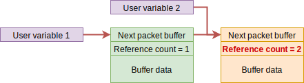

.. _api_lwesp_pbuf:

Packet buffer
=============

Packet buffer (or *pbuf*) is buffer manager to handle received data from any connection.
It is optimized to construct big buffer of smaller chunks of fragmented data as received bytes are not always coming as single packet.

Pbuf block diagram
^^^^^^^^^^^^^^^^^^

.. figure:: ../../static/images/pbuf_block_diagram.svg
    :align: center
    :alt: Block diagram of pbuf chain

    Block diagram of pbuf chain

Image above shows structure of *pbuf* chain. Each *pbuf* consists of:

* Pointer to next *pbuf*, or ``NULL`` when it is last in chain
* Length of current packet length
* Length of current packet and all next in chain

  * If *pbuf* is last in chain, total length is the same as current packet length

* Reference counter, indicating how many pointers point to current *pbuf*
* Actual buffer data

Top image shows ``3`` pbufs connected to single chain.
There are ``2`` custom pointer variables to point at different *pbuf* structures. Second *pbuf* has reference counter set to ``2``, as ``2`` variables point to it:

* *next* of *pbuf 1* is the first one
* *User variable 2* is the second one

.. table:: Block structure

	+--------------+-----------+------------+---------------------+-------------------+
	| Block number | Next pbuf | Block size | Total size in chain | Reference counter |
	+==============+===========+============+=====================+===================+
	| Block 1      | *Block 2* | ``150``    | ``550``             | ``1``             |
	+--------------+-----------+------------+---------------------+-------------------+
	| Block 2      | *Block 3* | ``130``    | ``400``             | ``2``             |
	+--------------+-----------+------------+---------------------+-------------------+
	| Block 3      | ``NULL``  | ``270``    | ``270``             | ``1``             |
	+--------------+-----------+------------+---------------------+-------------------+

Reference counter
^^^^^^^^^^^^^^^^^

Reference counter holds number of references (or variables) pointing to this block.
It is used to properly handle memory free operation, especially when *pbuf* is used by lib core and application layer.

.. note::
	If there would be no reference counter information and application would free memory while another part of library still uses its reference, application would invoke *undefined behavior* and system could crash instantly.

When application tries to free pbuf chain as on first image, it would normally call :cpp:func:`lwesp_pbuf_free` function. That would:

* Decrease reference counter by ``1``
* If reference counter ``== 0``, it removes it from chain list and frees packet buffer memory
* If reference counter ``!= 0`` after decrease, it stops free procedure
* Go to next pbuf in chain and repeat steps

As per first example, result of freeing from *user variable 1* would look similar to image and table below.
First block (blue) had reference counter set to ``1`` prior freeing operation.
It was successfully removed as *user variable 1* was the only one pointing to it,
while second (green) block had reference counter set to ``2``, preventing free operation.

.. figure:: ../../static/images/pbuf_block_diagram_after_free.svg
    :align: center
    :alt: Block diagram of pbuf chain after free from *user variable 1*

    Block diagram of pbuf chain after free from *user variable 1*

.. table:: Block diagram of pbuf chain after free from *user variable 1*

    +--------------+-----------+------------+---------------------+-------------------+
    | Block number | Next pbuf | Block size | Total size in chain | Reference counter |
    +==============+===========+============+=====================+===================+
    | Block 2      | *Block 3* | ``130``    | ``400``             | ``1``             |
    +--------------+-----------+------------+---------------------+-------------------+
    | Block 3      | ``NULL``  | ``270``    | ``270``             | ``1``             |
    +--------------+-----------+------------+---------------------+-------------------+

.. note::
    *Block 1* has been successfully freed, but since *block 2* had reference counter set to ``2`` before, it was only decreased by ``1`` to a new value ``1`` and free operation stopped instead.
    *User variable 2* is still using *pbuf* starting at *block 2* and must manually call :cpp:func:`lwesp_pbuf_free` to free it.

Concatenating vs chaining
^^^^^^^^^^^^^^^^^^^^^^^^^

This section will explain difference between *concat* and *chain* operations.
Both operations link ``2`` pbufs together in a chain of pbufs,
difference is that *chain* operation increases *reference counter* to linked pbuf,
while *concat* keeps *reference counter* at its current status.

.. figure:: ../../static/images/pbuf_cat_vs_chain_1.svg
    :align: center
    :alt: Different pbufs, each pointed to by its own variable

    Different pbufs, each pointed to by its own variable

Concat operation
****************

Concat operation shall be used when ``2`` pbufs are linked together and reference to *second* is no longer used.

.. figure:: ../../static/images/pbuf_cat_vs_chain_2.svg
    :align: center
    :alt: Structure after pbuf concat

    Structure after pbuf concat

After concating *2 pbufs* together, reference counter of second is still set to ``1``, however we can see that ``2`` pointers point to *second pbuf*.

.. note::
    After application calls :cpp:func:`lwesp_pbuf_cat`, it must not use pointer which points to *second pbuf*.
    This would invoke *undefined behavior* if one pointer tries to free memory while second still points to it.

An example code showing proper usage of concat operation:

.. literalinclude:: ../../examples_src/pbuf_cat.c
    :language: c
    :linenos:
    :caption: Packet buffer concat example

Chain operation
***************

Chain operation shall be used when ``2`` pbufs are linked together and reference to *second* is still required.

    Structure after pbuf chain

After chainin *2 pbufs* together, reference counter of second is increased by ``1``, which allows application to reference second *pbuf* separatelly.

.. note::
	After application calls :cpp:func:`lwesp_pbuf_chain`,
	it also has to manually free its reference using :cpp:func:`lwesp_pbuf_free` function.
	Forgetting to free pbuf invokes memory leak

An example code showing proper usage of chain operation:

.. literalinclude:: ../../examples_src/pbuf_chain.c
    :language: c
    :linenos:
    :caption: Packet buffer chain example

Extract pbuf data
*****************

Each *pbuf* holds some amount of data bytes. When multiple *pbufs* are linked together (either chained or concated), blocks of raw data are not linked to contiguous memory block.
It is necessary to process block by block manually.

An example code showing proper reading of any *pbuf*:

.. literalinclude:: ../../examples_src/pbuf_extract.c
    :language: c
    :linenos:
    :caption: Packet buffer data extraction

.. doxygengroup:: LWESP_PBUF