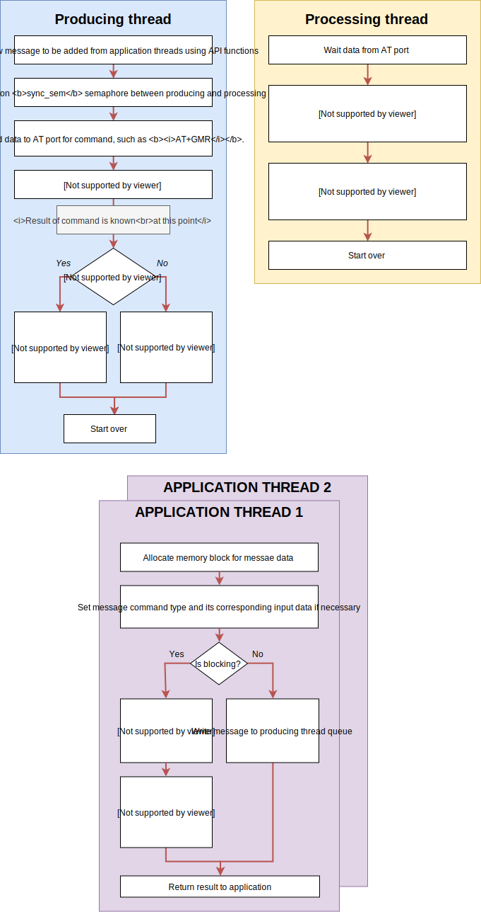

.. _um_inter_thread_comm:

Inter thread communication
==========================

ESP-AT middleware is only available with operating system.
For successful resources management, it uses ``2`` threads within library and allows multiple application threads to post new command to be processed.

	Inter-thread architecture block diagram

*Producing* and *Processing* threads are part of library, its implementation is in ``lwesp_threads.c`` file.

Processing thread
^^^^^^^^^^^^^^^^^

*Processing thread* is in charge of processing each and every received character from *ESP* device.
It can process *URC* messages which are received from *ESP* device without any command request. Some of them are:

* *+IPD* indicating new data packet received from remote side on active connection
* *WIFI CONNECTED* indicating *ESP* has been just connected to access point
* and more others

.. note::
	Received messages without any command (URC messages) are sent to application layer using events,
	where they can be processed and used in further steps

This thread also checks and processes specific received messages based on active command.
As an example, when application tries to make a new connection to remote server, it starts command with ``AT+CIPSTART`` message.
Thread understands that active command is to connect to remote side and will wait for potential ``+LINK_CONN:<...>`` message,
indicating connection status. it will also wait for ``OK`` or ``ERROR``,
indicating *command finished* status before it unlocks **sync_sem** to unblock *producing thread*.

.. tip::
	When thread tries to unlock **sync_sem**, it first checks if it has been locked by *producing thread*.

Producing thread
^^^^^^^^^^^^^^^^

*Producing thread* waits for command messages posted from application thread.
When new message has been received, it sends initial *AT message* over AT port.

* It checks if command is valid and if it has corresponding initial AT sequence, such as ``AT+CIPSTART``
* It locks **sync_sem** semaphore and waits for processing thread to unlock it

  * *Processing thread* is in charge to read respone from *ESP* and react accordingly. See previous section for details.

* If application uses *blocking mode*, it unlocks command **sem** semaphore and returns response
* If application uses *non-blocking mode*, it frees memory for message and sends event with response message

Application thread
^^^^^^^^^^^^^^^^^^

Application thread is considered any thread which calls API functions and therefore writes new messages to *producing message queue*,
later processed by *producing thread*.

A new message memory is allocated in this thread and type of command is assigned to it, together with required input data for command.
It also sets *blocking* or *non-blocking* mode, how command shall be executed.

When application tries to execute command in *blocking mode*, it creates new sync semaphore **sem**, locks it,
writes message to *producing queue* and waits for **sem** to get unlocked.
This effectively puts thread to blocked state by operating system and removes it from scheduler until semaphore is unlocked again.
Semaphore **sem** gets unlocked in *producing thread* when response has been received for specific command.

.. tip::
	**sem** semaphore is unlocked in *producing* thread after **sync_sem** is unlocked in *processing* thread

.. note::
    Every command message uses its own **sem** semaphore to sync multiple *application* threads at the same time.

If message is to be executed in *non-blocking* mode, **sem** is not created as there is no need to block application thread.
When this is the case, application thread will only write message command to *producing queue* and return status of writing to application.

.. toctree::
    :maxdepth: 2
    :glob: